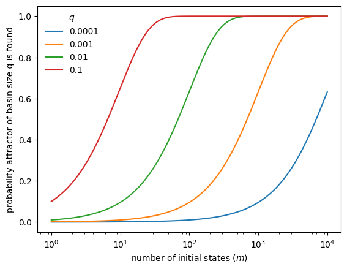

# Dynamics of Boolean Networks

In this tutorial, we study the *dynamics* of Boolean networks.
Building on the construction and structural analysis from previous tutorials,
we now focus on characterizing the long-term behavior of Boolean networks.

You will learn how to:

- simulate Boolean network dynamics under different updating schemes,
- compute and classify attractors,
- analyze basins of attraction,
- relate network structure to dynamical behavior.

## Setup

```python
import boolforge
import numpy as np
import pandas as pd
import matplotlib.pyplot as plt
```

## State space of a Boolean network

A Boolean network with $N$ nodes defines a dynamical system on the discrete
state space $\{0,1\}^N$.

Each state is a binary vector

$$
\mathbf{x} = (x_0, \ldots, x_{N-1}) \in \{0,1\}^N,
$$

where $x_i$ denotes the state of node $i$.

We use a small Boolean network as a running example.

```python
string = """
x = y
y = x OR z
z = y
"""

bn = boolforge.BooleanNetwork.from_string(string, separator="=")

print("Variables:", bn.variables)
print("N:", bn.N)
print("bn.I:", bn.I)
print("bn.F:")
for i, bf in enumerate(bn.F):
    print(f"  F[{i}] = {bf!r}")
```

    Variables: ['x' 'y' 'z']
    N: 3
    bn.I: [array([1]), array([0, 2]), array([1])]
    bn.F:
      F[0] = BooleanFunction(name='x', f=[0, 1])
      F[1] = BooleanFunction(name='y', f=[0, 1, 1, 1])
      F[2] = BooleanFunction(name='z', f=[0, 1])


All state vectors follow the variable order given by `bn.variables`.
For small networks, we can enumerate all $2^N$ states explicitly.

```python
all_states = boolforge.get_left_side_of_truth_table(bn.N)
print(pd.DataFrame(all_states, columns=bn.variables).to_string())
```

       x  y  z
    0  0  0  0
    1  0  0  1
    2  0  1  0
    3  0  1  1
    4  1  0  0
    5  1  0  1
    6  1  1  0
    7  1  1  1


## Dynamics of synchronous Boolean networks

Under *synchronous updating*, all nodes are updated simultaneously, defining
a deterministic update map

$$
\mathbf{x}(t+1) = F(\mathbf{x}(t)).
$$

### Exact computation
The update map $F$ can be evaluated directly for any state vector. In BoolForge,
this is implemented by the method `update_network_synchronously`. For convenience,
Boolean networks are callable, so that `bn(state)` evaluates the update map and
is equivalent to `bn.update_network_synchronously(state)`.

```python
for state in all_states:
    print(state, "-->", bn(state))
```

    [0 0 0] --> [0 0 0]
    [0 0 1] --> [0 1 0]
    [0 1 0] --> [1 0 1]
    [0 1 1] --> [1 1 1]
    [1 0 0] --> [0 1 0]
    [1 0 1] --> [0 1 0]
    [1 1 0] --> [1 1 1]
    [1 1 1] --> [1 1 1]


This output matches the synchronous truth table representation:

```python
print(bn.to_truth_table().to_string())
```

       x(t)  y(t)  z(t)  x(t+1)  y(t+1)  z(t+1)
    0     0     0     0       0       0       0
    1     0     0     1       0       1       0
    2     0     1     0       1       0       1
    3     0     1     1       1       1       1
    4     1     0     0       0       1       0
    5     1     0     1       0       1       0
    6     1     1     0       1       1       1
    7     1     1     1       1       1       1


Each state has exactly one successor, so the dynamics consist of transient
trajectories leading into *attractors* (steady states or cycles).

In this example, the network has:

- two steady states: $(0,0,0)$ and $(1,1,1)$,
- one cyclic attractor of length 2: $(0,1,0) \leftrightarrow (1,0,1)$.

### Exhaustive attractor computation
BoolForge contains a dedicated method to identify all attractors of a network
under synchronous update.

```python
dict_dynamics = bn.get_attractors_synchronous_exact()
```

The returned dictionary contains:

- `STG`: the synchronous state transition graph,
- `NumberOfAttractors`,
- `Attractors`,
- `AttractorID`,
- `BasinSizes`.

For computational reasons, binary states in $\{0,1\}^N$ are identified by their decimal representation.
The state transition graph can be decoded as follows:

```python
for state in range(2 ** bn.N):
    next_state = dict_dynamics["STG"][state]
    print(
        state,
        "=",
        boolforge.dec2bin(state, bn.N),
        "-->",
        next_state,
        "=",
        boolforge.dec2bin(next_state, bn.N),
    )
```

    0 = [0, 0, 0] --> 0 = [0, 0, 0]
    1 = [0, 0, 1] --> 2 = [0, 1, 0]
    2 = [0, 1, 0] --> 5 = [1, 0, 1]
    3 = [0, 1, 1] --> 7 = [1, 1, 1]
    4 = [1, 0, 0] --> 2 = [0, 1, 0]
    5 = [1, 0, 1] --> 2 = [0, 1, 0]
    6 = [1, 1, 0] --> 7 = [1, 1, 1]
    7 = [1, 1, 1] --> 7 = [1, 1, 1]


After repeated updates, the system settles into periodic behavior. That is,
irrespective of the initial state, an attractor is reached. The list
of all attractors (in decimal representation) can be displayed. 

```python
print(dict_dynamics['Attractors'])
```

    [[0], [2, 5], [7]]


Attractors can be printed in binary representation:

```python
for attractor in dict_dynamics["Attractors"]:
    print(f"Attractor of length {len(attractor)}:")
    for state in attractor:
        print(state, boolforge.dec2bin(state, bn.N))
    print()
```

    Attractor of length 1:
    0 [0, 0, 0]
    
    Attractor of length 2:
    2 [0, 1, 0]
    5 [1, 0, 1]
    
    Attractor of length 1:
    7 [1, 1, 1]
    


The information which state transitions to which attractor is stored in a dictionary.
Here, the indices correspond to the list of attractors in `dict_dynamics['Attractors']`.

```python
for state_dec,attr_id in enumerate(dict_dynamics['AttractorID']):
    print(state_dec,'--> attractor',attr_id,
          'which is',dict_dynamics['Attractors'][attr_id])
```

    0 --> attractor 0 which is [0]
    1 --> attractor 1 which is [2, 5]
    2 --> attractor 1 which is [2, 5]
    3 --> attractor 2 which is [7]
    4 --> attractor 1 which is [2, 5]
    5 --> attractor 1 which is [2, 5]
    6 --> attractor 2 which is [7]
    7 --> attractor 2 which is [7]


Finally, the basin size of each attractor is determined by the number of states that eventually transition to an attractor.
By definition, the sum of all basin sizes is always $2^N$. To simplify the comparison of
the basin size distribution for networks of different size, `BoolForge` normalizes the basin sizes by default.

```python
print(dict_dynamics['BasinSizes'])
```

    [0.125 0.5   0.375]


From the previous two outputs, we see that there is no state (other than 000) that eventually
transitions to 000. Half the states transition to the 2-cycle, while 3 out of 8
states transition to the attractor 111.

### Monte Carlo simulation

For larger networks, exhaustive enumeration is infeasible.
Monte Carlo simulation approximates the attractor landscape.

```python
dict_dynamics = bn.get_attractors_synchronous(n_simulations=1000)
print(dict_dynamics['Attractors'])
print(dict_dynamics['BasinSizesApproximation'])
```

    [[2, 5], [0], [7]]
    [0.496 0.134 0.37 ]


The simulation returns additional information:

- sampled initial states,
- the number of timeouts (trajectories not reaching an attractor before timeout).

```python
for key in dict_dynamics:
    print(key)
```

    Attractors
    NumberOfAttractorsLowerBound
    BasinSizesApproximation
    AttractorID
    InitialSamplePoints
    STG
    NumberOfTimeouts


In the absence of timeouts: If an attractor has relative basin size $q$, 
the probability that it is found from $m$ random initializations is $1 - (1-q)^m$.

```python
qs = [0.0001, 0.001, 0.01, 0.1]
ms = np.logspace(0, 4, 1000)

fig, ax = plt.subplots()
for q in qs:
    ax.semilogx(ms, 1 - (1 - q) ** ms, label=str(q))

ax.legend(title=r"$q$", frameon=False)
ax.set_xlabel("number of initial states ($m$)")
ax.set_ylabel("probability attractor of basin size q is found")
plt.show()
```


    

    


## Dynamics of asynchronous Boolean networks

Synchronous updating is computationally convenient but biologically unrealistic.
Asynchronous updating assumes that only one node changes at a time.

### Steady states under general asynchronous update

BoolForge can compute steady states under **general asynchronous updating**,
where at each step only a single node updates according to its Boolean rule.

```python
dict_dynamics = bn.get_steady_states_asynchronous_exact()
print(dict_dynamics['SteadyStates'])
print(dict_dynamics['NumberOfSteadyStates'])
```

    [0, 7]
    2


The result reveals the same two steady states as in the synchronous case.
However, the limit cycle observed under synchronous updating disappears
under asynchronous dynamics.

In addition, BoolForge returns the **full asynchronous state transition graph**.

```python
for state, successors in dict_dynamics["STGAsynchronous"].items():
    print(state, successors)
```

    0 {0: 1.0}
    1 {1: 0.3333333333333333, 3: 0.3333333333333333, 0: 0.3333333333333333}
    2 {6: 0.3333333333333333, 0: 0.3333333333333333, 3: 0.3333333333333333}
    3 {7: 0.3333333333333333, 3: 0.6666666666666666}
    4 {0: 0.3333333333333333, 6: 0.3333333333333333, 4: 0.3333333333333333}
    5 {1: 0.3333333333333333, 7: 0.3333333333333333, 4: 0.3333333333333333}
    6 {6: 0.6666666666666666, 7: 0.3333333333333333}
    7 {7: 1.0}


The state transition graph describes for each state the possible next states 
that the system may transition to, in addition to the transition probabilities. 
This graph can be interpreted as a **sparse transition matrix**
of a Markov chain. Each directed edge corresponds to a possible single-node update.

By repeatedly composing this transition matrix with itself (equivalently,
raising it to higher powers), BoolForge computes the **absorption probabilities**,
i.e., the probability that a trajectory starting from any state eventually
reaches each steady state.

```python
print(dict_dynamics['FinalTransitionProbabilities'])
```

    [[1.         0.        ]
     [0.5        0.5       ]
     [0.33333333 0.66666667]
     [0.         1.        ]
     [0.5        0.5       ]
     [0.33333333 0.66666667]
     [0.         1.        ]
     [0.         1.        ]]


The size of each basin of attraction is the (column-wise) average of these probabilities.

```python
print(dict_dynamics['BasinSizes'])
print(dict_dynamics['BasinSizes'] == 
      np.mean(dict_dynamics['FinalTransitionProbabilities'],0))
```

    [0.33333333 0.66666667]
    [ True  True]


Note that `BoolForge` currently does not detect complex cyclic attractors under
asynchronous update; for this task, specialized tools such as
[`pystablemotifs`](https://github.com/jcrozum/pystablemotifs) are recommended. 

In fact, some of BoolForge's asynchronous update methods fail when the network
contains no steady state. 

### Monte Carlo approximation

As in synchronous case, `BoolForge` also contains a Monte Carlo routine
for sampling asynchronous dynamics.

The simulation provides:

- a lower bound on the number of steady states,
- approximate basin size distributions,
- samples of the asynchronous state transition graph.

```python
dict_dynamics = bn.get_steady_states_asynchronous(n_simulations=500)
print(dict_dynamics['SteadyStates'])
print(dict_dynamics['NumberOfSteadyStatesLowerBound'])
print(dict_dynamics['BasinSizesApproximation'])
```

    [7, 0]
    2
    [0.652 0.348]


### Sampling from a fixed initial condition
In biological Boolean network models, a specific state $\mathbf x \in \{0,1\}^N$
is frequently considered the initial state, e.g., corresponding to the G0 phase of the cell cylce.
To enable exploration of the stochastic trajectories from a specific state, BoolForge
contains the following method.

```python
dict_dynamics = bn.get_steady_states_asynchronous_given_one_initial_condition(
    initial_condition=[0, 0, 1], n_simulations=500
)
print(dict_dynamics['SteadyStates'])
print(dict_dynamics['NumberOfSteadyStatesLowerBound'])
print(dict_dynamics['BasinSizesApproximation'])
```

    [7, 0, 9]
    3
    [0.404 0.464 0.132]


Note the equivalent analysis under synchronous update is trivial because the dynamics
are deterministic and the long-term behavior when starting in a specific initial
condition can be found by

```python
dict_dynamics = bn.get_attractors_synchronous(n_simulations=1,
                                              initial_sample_points=[[0,0,1]],
                                              initial_sample_points_are_vectors=True)
dict_dynamics
```


    {'Attractors': [[2, 5]],
     'NumberOfAttractorsLowerBound': 1,
     'BasinSizesApproximation': array([1.]),
     'AttractorID': {2: 0, 5: 0},
     'InitialSamplePoints': [[0, 0, 1]],
     'STG': {1: 2},
     'NumberOfTimeouts': 0}


## Summary and outlook

In this tutorial you learned how to:

- simulate Boolean network dynamics,
- compute synchronous attractors exactly and approximately,
- analyze basin sizes,
- compute steady states under asynchronous updating.

This concludes the function- and network-level analysis.
Subsequent tutorials focus on analyzing stability to perturbations, control analysis, 
and ensemble experiments.
